# Robot Gladiators Game!

## Purpose

This is a combat simulator game called Robot Gladiators. During the game, players will coach their robot through a series of fights—gaining cash, attack power, and repairs along the way. The robot that survives with the most cash will be remembered in the browser's storage system!

## User Story

As a game developer
I want to be able to view the game in browser
So that I am able to play the game in browser and the fight will be saved in the browser's storage system

## Acceptance Criteria

The game must be created by a single developer in 24 hours.
The game must run in a web browser.
The game must use the provided index.html file.
Only the <title> element of index.html may be changed.
Participants cannot use CSS.
All game code must be contained in the game.js JavaScript file.
Extra points will be given for high-quality code

## Built With:

- HTML
- Javascript

## Website

https://theresa2013.github.io/robot-gladiators/

## GitHub

https://github.com/Theresa2013/robot-gladiators.git

## Screenshots

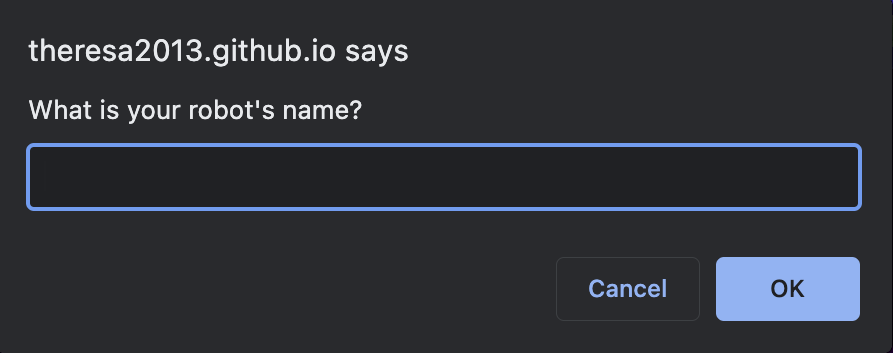
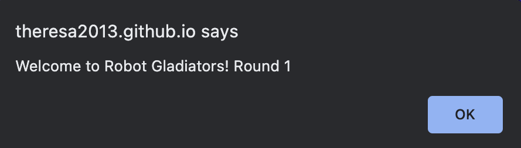
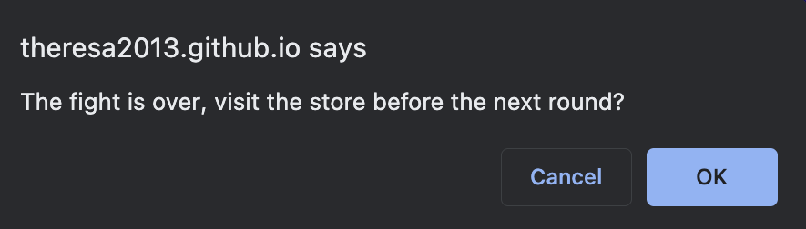
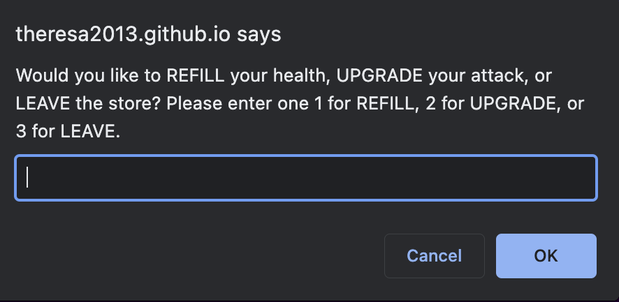
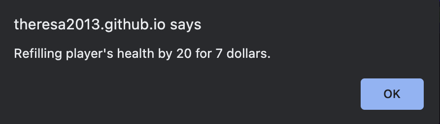
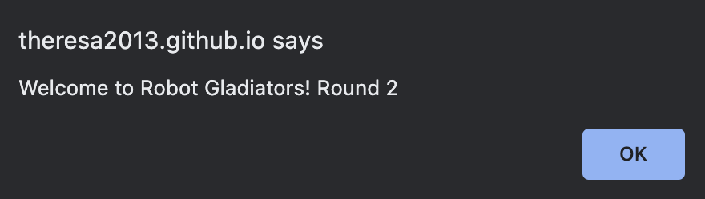
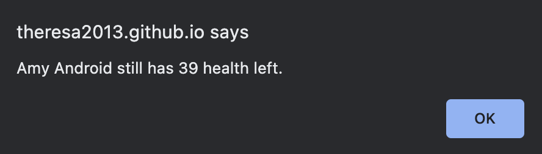
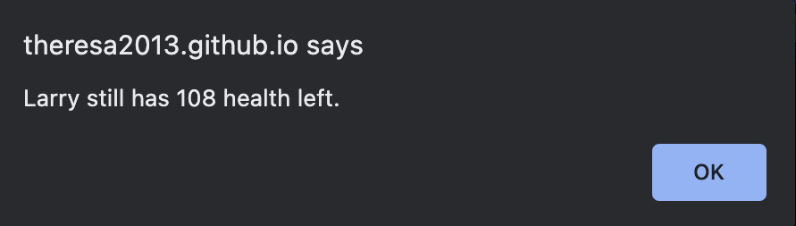
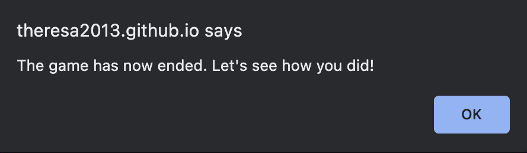
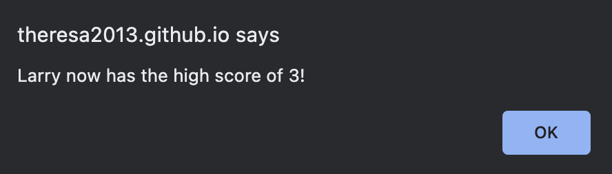
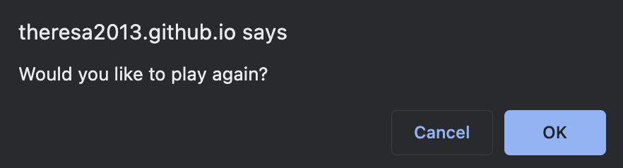
